# PanelLayout  [  ](https://bintray.com/juanlabrador/maven/PanelLayout/_latestVersion)
A group of view in container to style iOS 7. For API 19+


How to use
----------
```groovy
compile 'com.github.juanlabrador:panellayout:2.1.2@aar'
```

In your xml
-----------
```xml
  <com.github.juanlabrador.panellayout.PanelLayout
      android:id="@+id/group"
      android:layout_width="match_parent"
      android:layout_height="wrap_content"/>
```

If you want to customize it, applies these attributes supported:

```xml
  <attr name="backgroundColor" format="color"/>
  <attr name="backgroundBorderColor" format="color"/>
  <attr name="labelTextColor" format="color"/>
  <attr name="contentTextColor" format="color"/>
  <attr name="separatorColor" format="color"/>
  <attr name="textSizeLayout" format="dimension"/>
  <attr name="withBorder" format="boolean"/>
```

Then, you must add this line to apply them

```xml
  xmlns:panel="http://schemas.android.com/apk/res-auto"
```
```xml
  <com.github.juanlabrador.panellayout.PanelLayout
      android:id="@+id/group"
      android:layout_width="match_parent"
      android:layout_height="wrap_content"
      panel:textSizeLayout="16sp"/>
```

By default:

- BorderBackgroundColor is TRANSPARENT
- BackgroundColor is WHITE
- SeparatorColor is LTGRAY
- LabelTextColor is BLACK
- ContentTextColor is GRAY
- TextSizeLayout is 14sp
- WithBorder is true

In your class java
------------------
You declare a PanelLayout object:

```java
  private PanelLayout mPanelLayout;
  ...
  ...
  mPanelLayout = (PanelLayout) findViewById(R.id.group);

```
Add TextLayout
--------------


You can use values String or Text as parameters.

```java
  mPanelLayout.addTextLayout("Name", "Juan Labrador");
  mPanelLayout.addTextLayout(R.string.age, "23");
  mPanelLayout.addTextLayout("Develop by", "Juan Labrador");
```

To edit the label or content, you need to declare a TextLayout object:

```java
  private TextLayout mName;
  ...
  mName = mPanelLayout.addTextLayout("Name", "Juan Labrador");
  ...
  mName.setLabel("Last Name");
  mName.setContent("Labrador");
```
Add EditTextLayout
-----------------
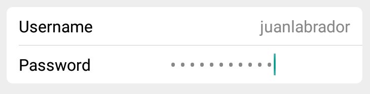

You can use values String or Text as parameters, add too a InputType.

```java
  mPanelLayout.addEditTextLayout("Username");
  mPanelLayout.addEditTextLayout("Password");
```

To edit the label or content, you need to declare a EditTextLayout object:

```java
  EditTextLayout mPassword = mPanelLayout.addEditTextLayout("Password");

  mPassword.isPassword(true);  // Change input type to password

  mPhone.isNumber(true);   // Change input type to number
  mEmail.isEmail(true);   // Change input type to email
```
Add MultiTextLayout
-------------------
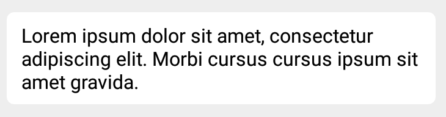

```java
  mPanelLayout.addMultiTextLayout(R.string.description);

```

When you do to long press, you copy content to Clipboard.

Add MultiEditTextLayout
-----------------------

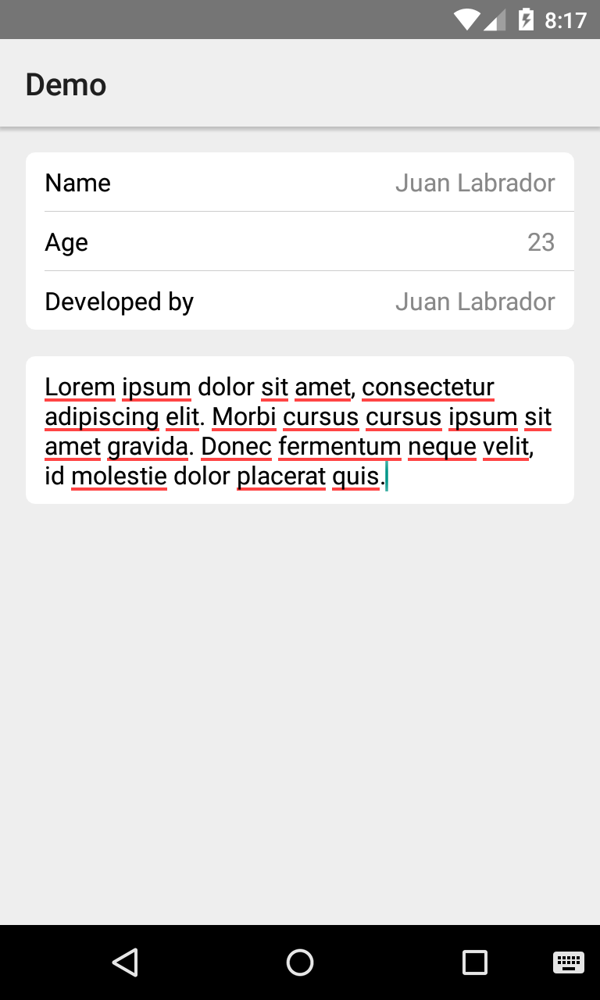

- First parameter is for the hint text.
- Second parameter is for the content text.

```java
  mPanelLayout.addMultiEditTextLayout(R.string.description);
```
Add PopupLayout
---------------

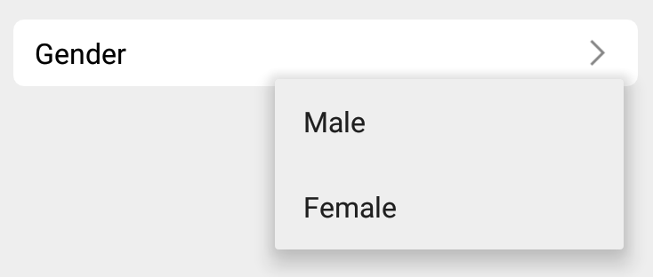


You can use values String or Text. Add a menu of res, or String[] or ArrayList<String>. You can use our standards icons or add your icon.

```java
  PopupLayout mPopupLayout = mPanelLayout.addPopupLayout("Gender", R.menu.menu_gender);

  mPopupLayout.getContent();  // Get content selected
  mPopupLayout.getItemPosition();  // Get position item menu
  ...
  ...
  mPanelLayout.addPopupLayout("Country", country);  // With String[]
  mPanelLayout.addPopupLayout("Age", age);  // With ArrayList
  mPanelLayout.addPopupLayout("Gender", R.menu.menu_main, R.drawable.youricon);
```
Add ButtonLayout
----------------


You can use values String or Text as parameters, add a text of content and a icon.

```java
  mPanelLayout.addButtonLayout("Phone", "+ 58 424 0000000", R.mipmap.phone);
  ButtonLayout mEmail = mPanelLayout.addButtonLayout("Email", "juanjavierlabrador@gmail.com", R.mipmap.message);
  mEmail.setOnClickListener(new View.OnClickListener() {
      @Override
      public void onClick(View view) {
            // Intent call phone
      }
  });
  ...
  ...
  mEmail.getContent();

```
Add SwitchLayout
----------------
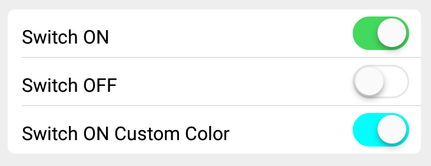

You can use values String or Text as parameters, indicate a color when check on, and assign a status to the switch.

```java
  mPanelLayout.addSwitchLayout("Switch ON Default", true);
  SwitchLayout mSwitch = mPanelLayout.addSwitchLayout("Switch OFF Default");
  mPanelLayout.addSwitchLayout("Switch ON Other Color", Color.CYAN, true);
  ...
  ...
  mSwitch.isChecked();
  mSwitch.setChecked(true);
```
Add ValidatorTextLayout
-------------------
Use the icons:

- dataProgress(); Working validation view


- dataCheck(); Check text
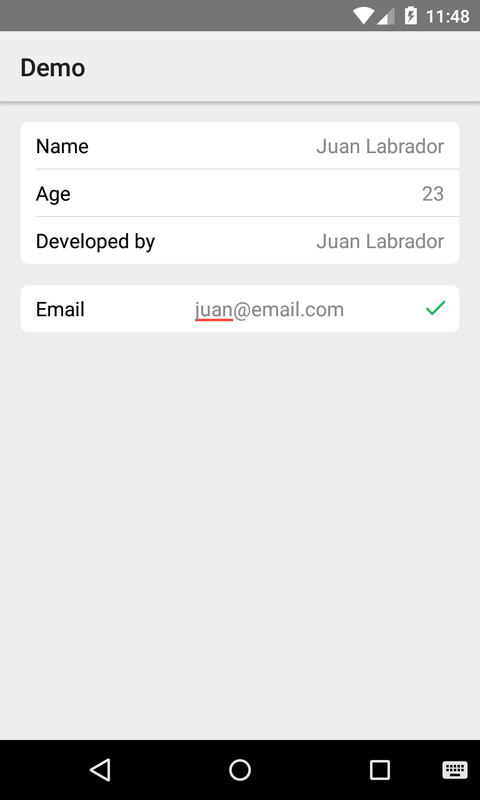

- dataError(); Error in text input
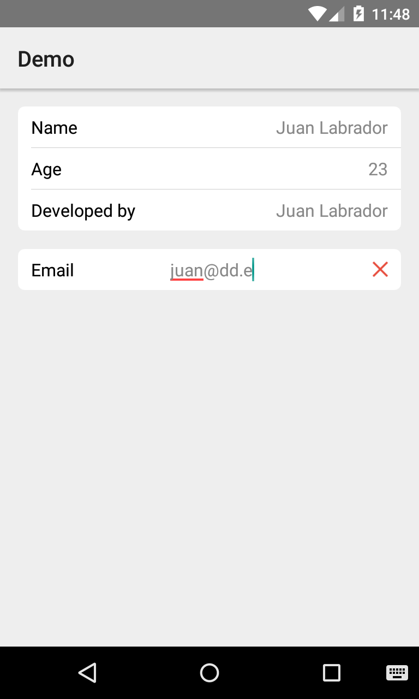

- dataError("Email invalidate!");  Show message with popup
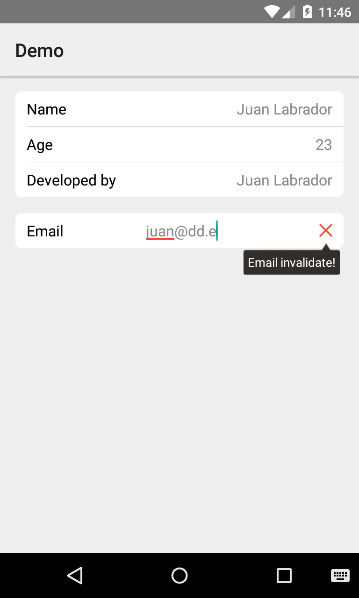

You can use values String or Text. Use it to validate a search.

```java
  final ValidatorTextLayout mValidator = mPanelLayout2.addValidatorLayout("Email");
  mValidator.addTextChangedListener(new TextWatcher() {
      @Override
      public void beforeTextChanged(CharSequence charSequence, int i, int i1, int i2) {

      }

      @Override
      public void onTextChanged(CharSequence charSequence, int i, int i1, int i2) {

      }

      @Override
      public void afterTextChanged(Editable editable) {
          if (Condition correct) {
              mValidator.dataCheck();
          } else if (Condition error) {
              mValidator.dataError();
          } else {
              mValidator.dataProgress();
          }
      }
  });
```
Add ExtendTextLayout
--------------------
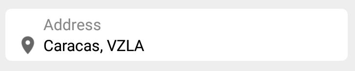

```java
  mPanelLayout.addExtendTextLayout(R.mipmap.marker, "Address", "Caracas, VZLA");
```
Add ExtendEditTextLayout
-----------------


```java
  mPanelLayout.addExtendEditTextLayout(R.mipmap.marker, "Address");
```
Add ExtendValidatorTextLayout
-------------------
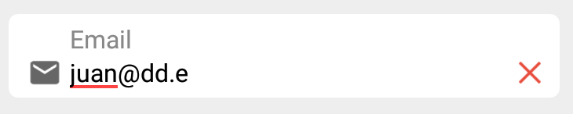

```java
  final ExtendValidatorTextLayout mValidator = mPanelLayout.addExtendValidatorLayout(R.mipmap.message, "Email");
  mValidator.addTextChangedListener(new TextWatcher() {
      @Override
      public void beforeTextChanged(CharSequence charSequence, int i, int i1, int i2) {

      }

      @Override
      public void onTextChanged(CharSequence charSequence, int i, int i1, int i2) {

      }

      @Override
      public void afterTextChanged(Editable editable) {
          if (mValidator.getContent().equals("juan@email.com")) {
              mValidator.dataCheck();
          } else if (mValidator.getContent().equals("juan@dd.e")) {
              mValidator.dataError();
          } else {
              mValidator.dataProgress();
          }
      }
  });
```
Add ExtendPopupLayout
---------------
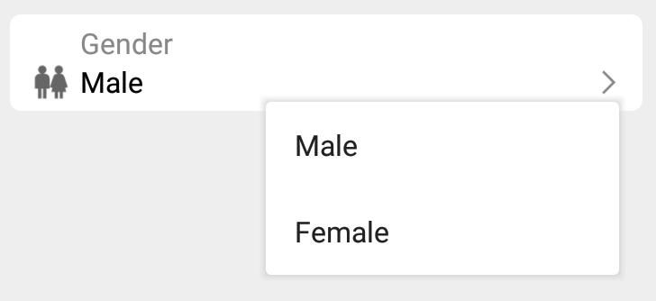

You can use values String or Text. Add a menu of res, or String[] or ArrayList<String>. You can use our standards icons or add your icon.

```java
  ExtendPopupLayout mPopupLayout = mPanelLayout.addExtendPopupLayout(R.mipmap.gender, "Gender", R.menu.menu_gender);

  mPopupLayout.getContent();  // Get content selected
  mPopupLayout.getItemPosition();  // Get position item menu
  ...
  ...
  mPanelLayout.addExtendPopupLayout(R.mipmap.gender, "Gender", gender);  // With String[]
  mPanelLayout.addExtendPopupLayout(R.mipmap.gender, "Gender", gender); // With ArrayList
  mPanelLayout.addExtendPopupLayout(R.mipmap.gender, "Gender", R.menu.menu_main, R.drawable.youricon);
```
Log
----
v2.1.2
- Added getItemTitle by position in PopupLayout

v2.1.1
- Minor changes ProgressBar

v2.1
- Added ExtendPopupLayout

v2.0
- Added ExtendValidatorTextLayout

v1.9
- Added ExtendEditTextLayout
    - Added isURL(boolean);

v1.8
- Added ExtendTextLayout

v1.7
- Added ValidatorTextLayout

v1.6.1
- Change Switch Style iOS

v1.6
- Added SwitchLayout

v1.5
- Added ButtonLayout

v1.4
- Added PopupLayout

v1.3
- Added MultiEditTextLayout

v1.2
- Added MultiTextLayout

v1.1.1
- Updated EditTextLayout
    - isNumber(boolean)
    - isEmail(boolean)

v1.1
- Added EditTextLayout
    - isPassword(boolean)

v1.0
- Added TextLayout

Developed by
------------

- Juan Labrador - <juanjavierlabrador@gmail.com>
- Twitter: <a href="https://twitter.com/juanlabrador">@JuanLabrador</a>

Inspiration in
--------------

<a href="https://github.com/vladexologija/GroupedTextView">GroupedTextView</a>


Credits
-------
- For <a href="https://github.com/kyleduo/SwitchButton">SwitchButton</a>
- For <a href="https://github.com/pnikosis/materialish-progress">materialish-progress</a>

